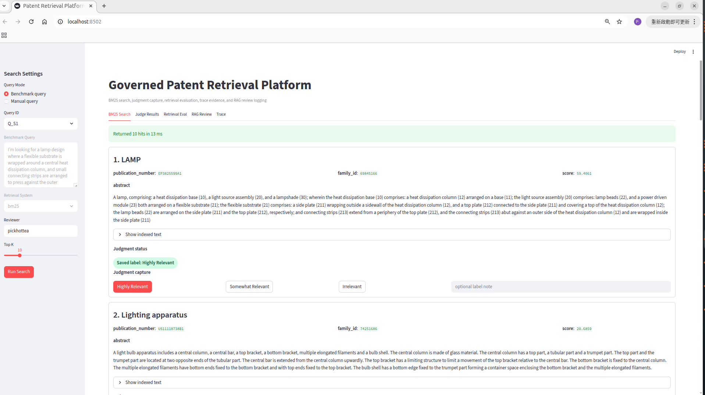
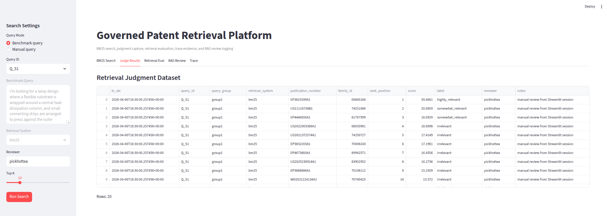
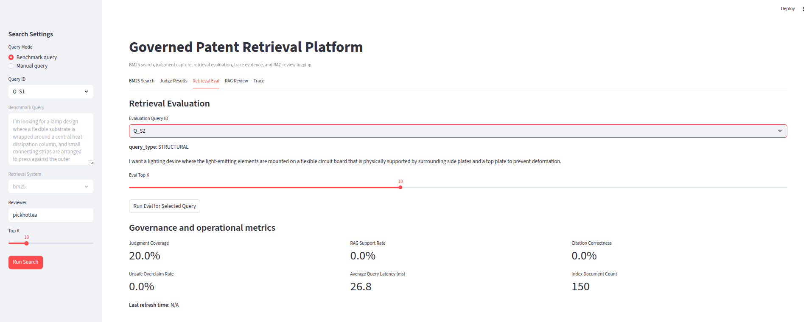
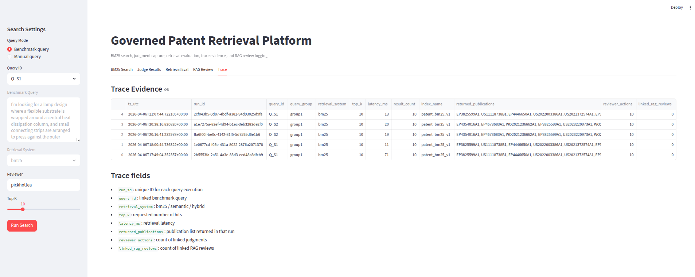

# Governed Patent Analytics and Retrieval Platform

SQL-first patent warehouse and retrieval platform built with SQL Server, dbt, Elasticsearch, and Power BI-facing marts.

---

## Overview

This repository demonstrates a **governed, extensible patent data platform**, not a one-off analysis.

The platform is designed around three goals:

1. Build a reliable SQL Server warehouse for patent data using bronze, silver, and gold layers.
2. Model analytics-ready datasets in dbt for reporting and downstream BI use.
3. Provide a governed retrieval-serving layer using Elasticsearch BM25 over publication-level patent text.

This project emphasizes **platform design, data contracts, lifecycle thinking, and reproducible pipelines**, rather than ad hoc analysis.

---

## Platform Positioning

This is **not a dataset showcase**.

The current scope is intentionally limited to ~150 patent families, used as a **controlled pilot dataset** to validate:

- family-level modeling
- deduplication logic
- canonical key design
- retrieval corpus construction
- analytics + search consistency
- governance and lifecycle policies

> The value of this project is not in dataset size, but in establishing a **scalable, maintainable, and governed patent platform foundation**.

---

## Architecture Summary

The platform is organized into two connected layers:

### 1. Analytics warehouse layer

Supports reporting, modeling, and BI.

- SQL Server warehouse (bronze / silver / gold)
- dbt staging and marts
- publication, family, IPC, applicant, inventor models
- Power BI-facing marts
- governed dimensional modeling

---

### 2. Retrieval serving layer

Supports publication-level search.

- BM25 document preparation
- Elasticsearch index / load / query
- governed separation from analytics layer
- validated retrieval behavior

---

## BM25 Retrieval Layer

BM25 retrieval pipeline has been successfully implemented end-to-end, with a governed publication universe of 150 anchor publications, fallback-safe corpus construction, and Elasticsearch-based ranking validated.

### Key Design Decisions

- **Search universe = anchor publications (150), not artifact subset (149)**
- **Fallback-safe corpus**: title-only documents allowed when abstract missing
- **Decoupled architecture**: retrieval is not constrained by upstream artifact completeness
- **BM25 validated via Elasticsearch ranking behavior**

### Current State

- Source table: `gold.bm25_document`
- Index: `patent_bm25_v1`
- Documents indexed: 150
- Query path validated through Elasticsearch `_search`
- Streamlit review workflow enabled for benchmark query evaluation
- Initial benchmark judgments completed for `Q_S1` and `Q_S2`

### Streamlit Review and Evaluation UI

A Streamlit-based review interface is included to support benchmark-driven retrieval evaluation and evidence capture.

Current UI capabilities include:

- benchmark query selection
- BM25 result inspection
- human relevance judgment capture
- retrieval evaluation
- trace evidence inspection
- RAG review logging scaffold

This UI is designed as an evidence capture interface rather than a demo-only layer. It supports the collection of:

- benchmark queries
- human judgments
- query execution logs
- retrieval result logs
- traceable evaluation outputs

### Streamlit UI Screenshots

#### BM25 Search


#### Judge Results


#### Retrieval Evaluation


#### Trace Evidence


---

## Core Modeling Decisions

### Canonical keys

- `family_id` → family-level identity
- `publication_number` → publication-level identity

These are **governed identifiers** and should not be replaced.

---

### Family-publication alignment

Corrected to:

`family_id → bridge_family_ops_cluster → ops_family_members`

instead of broken seed-publication matching.

---

### Publication semantics

`dim_publication` is **publication-level**, not enforcing strict 1:1 family mapping.

---

## Data Lifecycle Policy

This platform treats data as **stateful assets**, not static tables.

### Lifecycle stages

1. Ingested (raw)
2. Normalized (structured)
3. Resolved (family mapping / dedup)
4. Curated (gold / retrieval-ready)
5. Served (analytics + search)
6. Reviewed (human / evaluation)
7. Monitored (refresh / change tracking)
8. Archived / pruned

---

## Retention Policy

Retention follows **function, not patent term**.

| Layer | Retention logic |
|------|----------------|
| Registry (family/publication) | long-term |
| Governance (decisions, mapping) | medium-long |
| Raw / intermediate | short-term (reproducible) |
| Logs / telemetry | short-term |

Principle:

> Keep what is required for traceability, governance, and serving.  
> Discard what can be reconstructed.

---

## Data Governance

This project includes foundational governance thinking:

- canonical identifiers
- controlled modeling layers
- lineage-aware transformations
- retrieval vs analytics separation
- reproducible pipelines
- explicit lifecycle boundaries

---

## Repository Structure

```text
.
├── artifacts/
│   ├── audit/
│   └── eval/
├── dbt_patent_led/
├── docs/
│   ├── architecture/
│   └── screenshots/
├── search/
│   └── elasticsearch/
├── sql/
│   ├── bronze/
│   ├── silver/
│   ├── gold/
├── tests/
├── ui/
└── PIPELINE_ENTRYPOINT.md

```
## What This Repository Demonstrates

- analytics engineering
- data platform design
- governed warehouse modeling
- retrieval-serving architecture (BM25)
- lifecycle-aware data management
- BI-ready mart design
- separation of concerns (analytics vs retrieval)

---

## Current Status

- warehouse foundation established
- dbt marts and tests implemented
- Power BI marts defined
- BM25 retrieval pipeline validated (150 publications)
- Streamlit-based review, trace, and evaluation workflow implemented
- governance and architecture documented

---

## Next Extensions

- semantic retrieval layer (embedding-based)
- hybrid retrieval (BM25 + semantic)
- citation-grounded RAG layer
- expansion of benchmark query coverage
- larger-scale human relevance judgments
- richer retrieval evaluation (Precision@k / nDCG by query type)
---

## Author

Built by pickhottea as a **governed patent analytics and retrieval platform**, focusing on:

- data governance
- warehouse architecture
- analytics engineering
- retrieval system design
